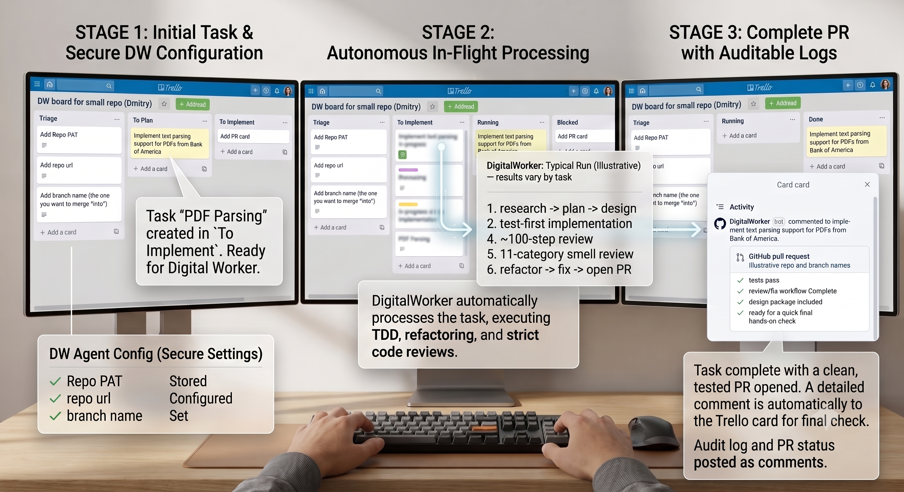

# DigitalWorker

---

---

## **You make the decisions that matter. DigitalWorker turns a task card into a tested, reviewed, production-ready pull request.**

**No iterative prompting. No babysitting. No cleaning up after the AI.**

---

## The problem developers are talking about

AI generates code quickly. The expensive part is still understanding it, checking it, fixing it, and making sure it fits the business and architecture.

Sonar's 2026 survey of 1,149 professional developers found that 96% do not fully trust AI-generated code to be functionally correct, and 38% say reviewing it requires more effort than reviewing code written by human colleagues.

DigitalWorker is a fully autonomous AI coding agent with optional, high-leverage human decision checkpoints. It changes the division of labor: in the creator's current production use, human attention is normally limited to **spot-reviewing and correcting selected sections of the document package covering research, planning, architecture, and class design**, **a quick architectural spot-check of key Domain code**, and **a quick final hands-on check**. The creator does not review generated code line by line for correctness or review generated tests.

*Those are founder-observed operating practices, not an independent benchmark or a guarantee for every repository.*

## Why it's different

- **Keep control without supervising every step.** Review important assumptions, product choices, and architecture trade-offs instead of managing an iterative prompt loop.
- **Get engineering evidence, not just generated code.** Every feature starts with a failing test. The pipeline then runs a 23-step AI review covering requirements, architecture, design, and code, an 11-category code-smell review, refactoring, and fixes before opening the PR.
- **Scale the product without letting software complexity become the limit.** Test-first TDD, Clean Architecture, and OOP/Rich Domain Model discipline are not cosmetic preferences: they keep behavior testable, dependencies directional, and domain concepts explicit so new features do not become disproportionately harder, slower, and riskier as the product, team, and business grow.
- **High-precision instruction execution.** AI actively resists Agile, OOP/Rich Domain Model, Clean Architecture, and Clean Code — defaulting to anti-patterns it was trained on. DigitalWorker's proprietary engine overcomes that resistance, keeping dozens of workflow steps on track. In routine use, virtually all required instructions are followed.
- **Battle-tested engineering method.** The workflow package reflects more than 20 years of Agile and OOP practice and two years of iterative use with AI coding agents. It steers the agent toward proper OOP/Rich Domain Models, Clean Architecture, evidence before implementation, and code that stays intuitive as the system grows.
- **A combination we have not found elsewhere.** Other agents can code, test, review, or open PRs. We are not aware of another commercial coding agent that combines high precision complex multi-step instruction enforcement with this depth of Agile, OOP/Rich Domain Model, TDD, review, and refactoring discipline.
- **Protected proprietary instructions.** DigitalWorker's instructions and customer-authored instructions stay behind our instruction service, with input/output screening and immediate blocking after a detected IP extraction attempt.
- **Parallel, isolated execution.** Multiple cards can run simultaneously in separate Git worktrees; the AI agent runs in Docker isolation while the host controls GitHub write-back.
- **Frictionless to start.** Send a Trello board name, connect GitHub from the first card — no install, no terminal, no per-developer setup.

**Best fit:** Teams already using AI coding tools that want autonomous implementation without surrendering pivotal product and design decisions. DigitalWorker is strongest today on C#/.NET; other languages use the same test-first and review discipline while language-specific coverage automation expands.

## Try it on your real task

1. **Send a Trello board name** and connect your repository.
2. **Add one bounded task** with clear acceptance criteria.
3. **Receive the tested, reviewed PR and design package**, then perform your final behavior and architecture check.

**Use the included $15 credit to evaluate one real task before paying.**  
**Reply to the message that included this sheet or**
* 💬 Message me directly on [LinkedIn](https://www.linkedin.com/in/grand)
* ✉️ Email me at: [info@agiledigitalworker.com](mailto:info@agiledigitalworker.com)

[Read the User Guide](user-guide.md)

Agile Design LLC · New York, NY  
© 2026 Agile Design LLC. DigitalWorker and its workflow materials are proprietary.

---

